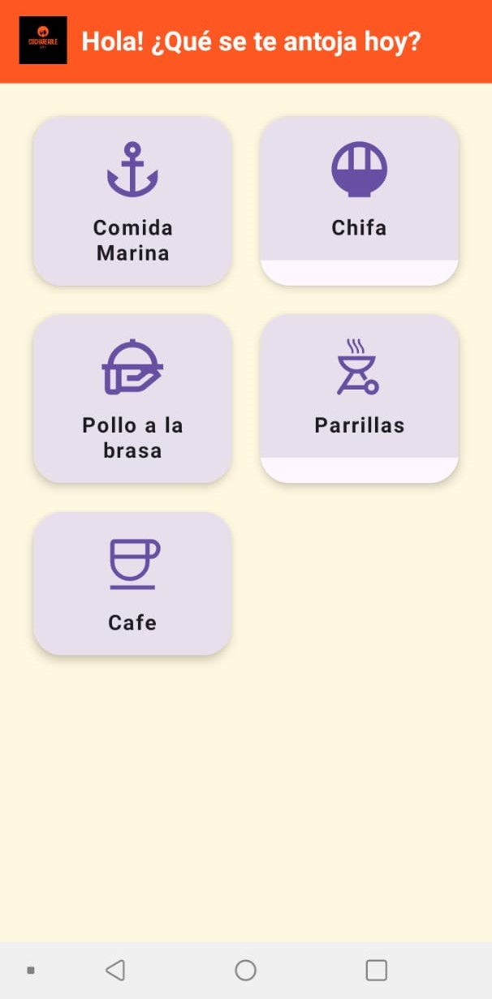
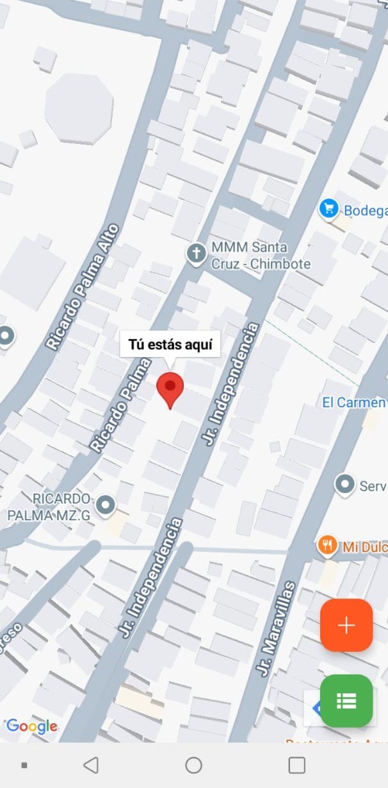
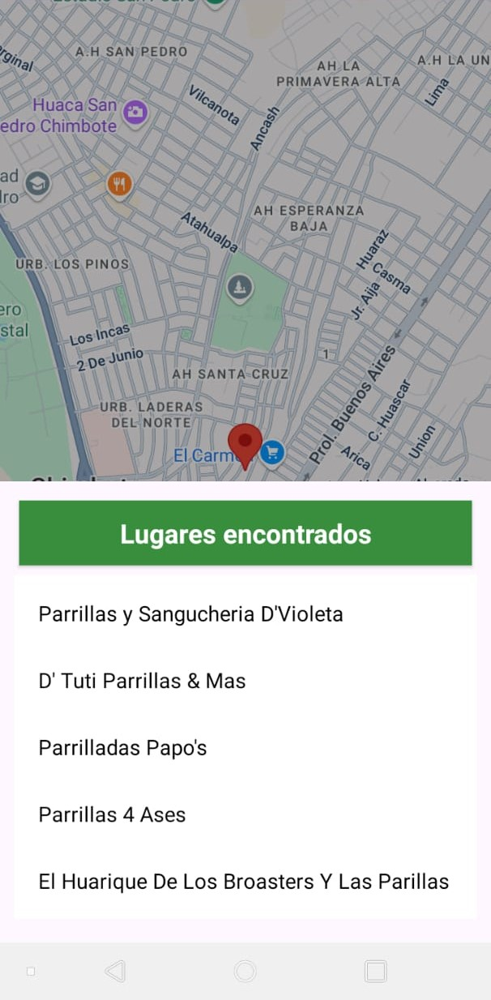
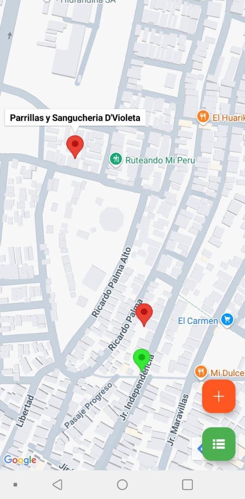
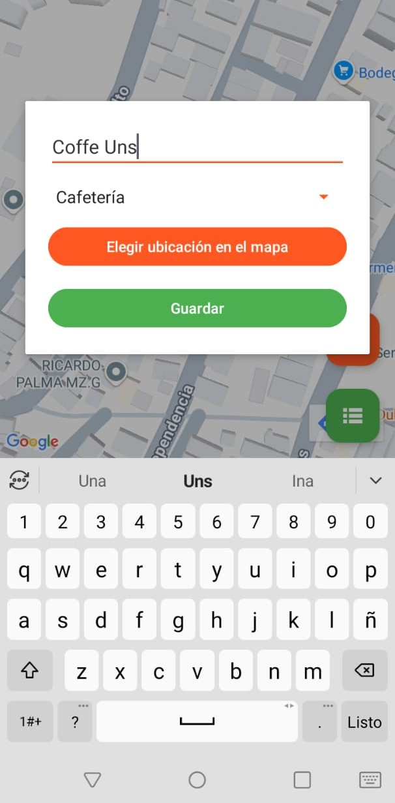
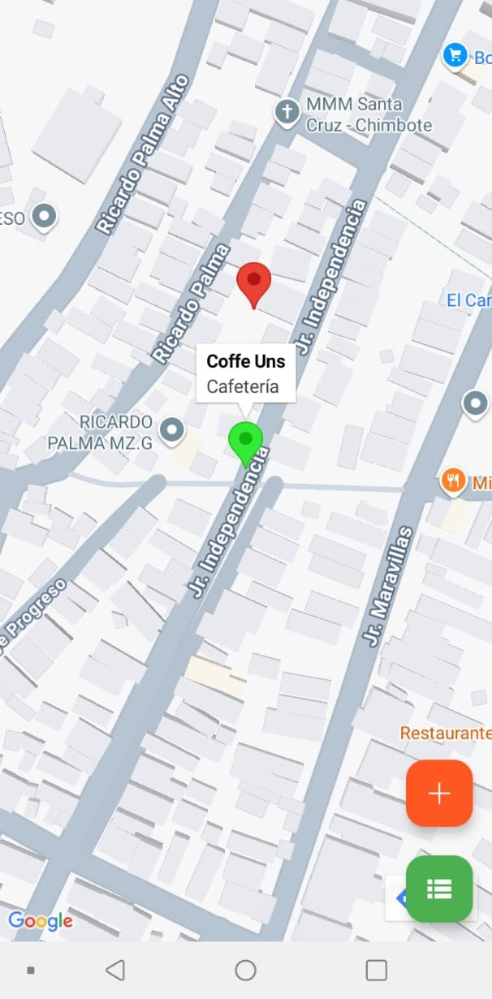

# 🥄 CuchareableApp

**CuchareableApp** es una aplicación móvil desarrollada en Kotlin que permite a los usuarios descubrir los mejores huariques (lugares para comer) cercanos, filtrados por categoría de comida. Utiliza Google Maps y Material Design 3 para ofrecer una experiencia intuitiva, moderna y útil tanto para locales como para turistas.

## 📱 Características principales

- 🗺️ Mapa interactivo con integración de Google Maps
- 🍲 Selección por categorías gastronómicas (ej. Marina, Chifa, Criolla, etc.)
- 📍 Visualización de negocios en el mapa según categoría seleccionada
- ➕ Agregado de nuevos puntos por parte de los usuarios (colaborativo)
- 🖼️ Vista limpia y profesional con componentes de Material Design 3

## 🧱 Tecnologías utilizadas

- Kotlin (imperativo, sin MVVM)
- Google Maps SDK for Android
- Material Design 3 (Material Components)
- LiveData (para actualizaciones reactivas en algunas vistas)
- Android Studio & SDK 34+

## 📸 Capturas de pantalla

- Pantalla principal, donde se elegirán las categoría de comida de acuerdo a su preferencia

- Pantalla del mapa, en primer lugar se mostrará tu ubicación en tiempo real

- Luego se mostrará un BottomSheet con una lista de negocios cercanos a tu ubicación

- Al elegir algun elemento de la lista nos marcará ese negocio en el mapa, podemos entrar y salir de la lista haciendo uso del botón verde.

- También cuenta con un modal para agregar una ubicación personalizada para un negocio en cualquier categoría.

